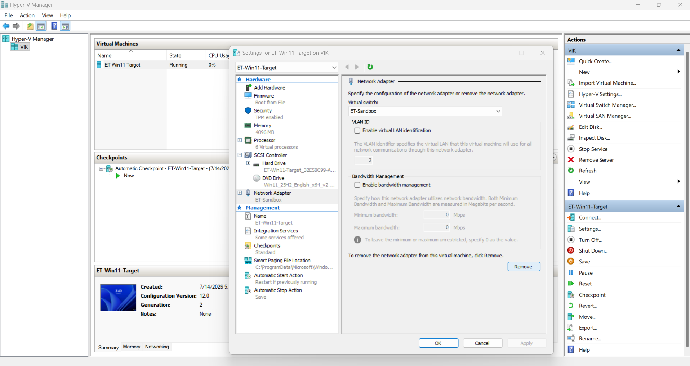
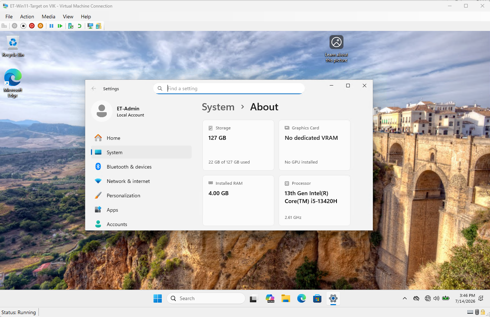
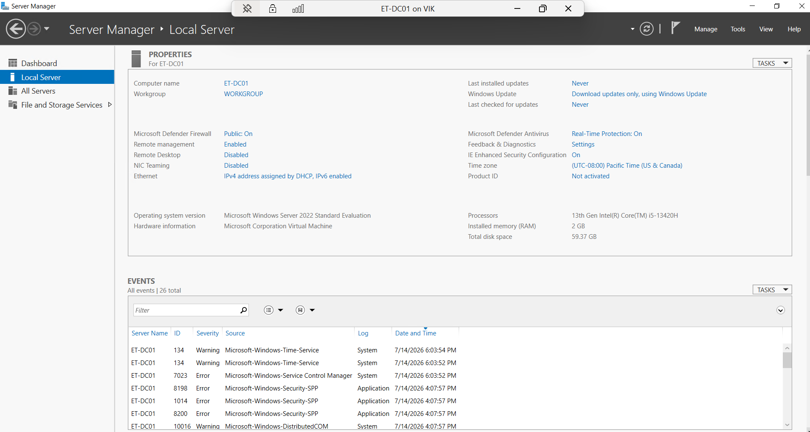
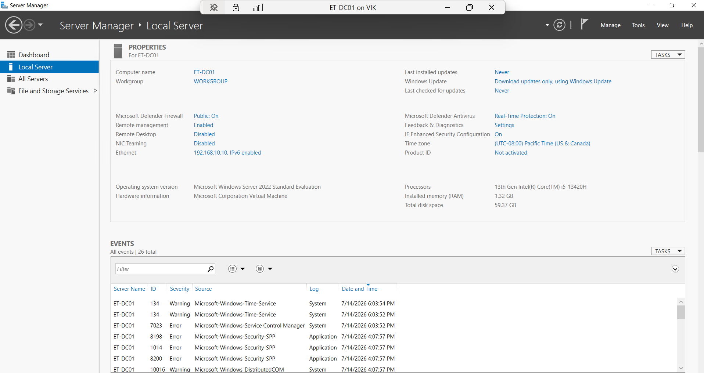
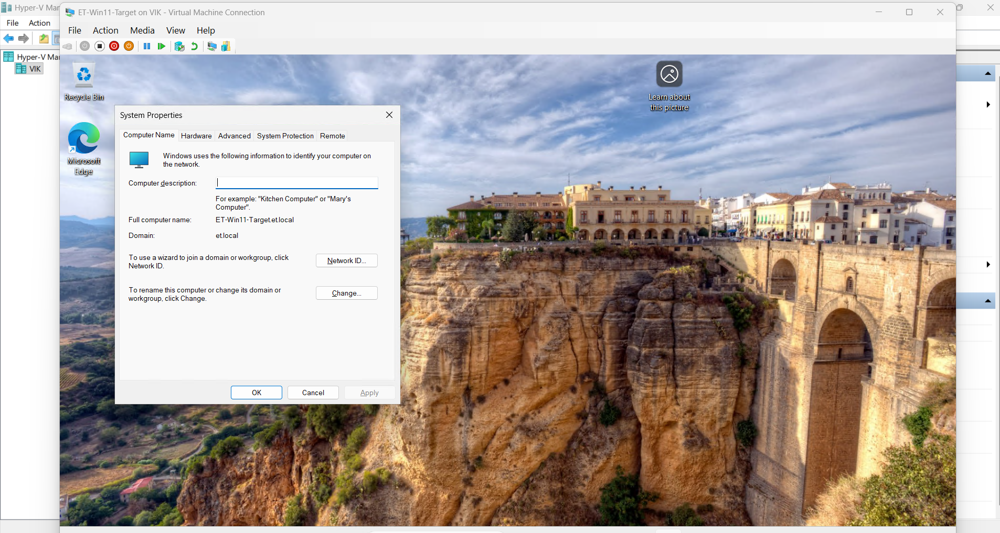
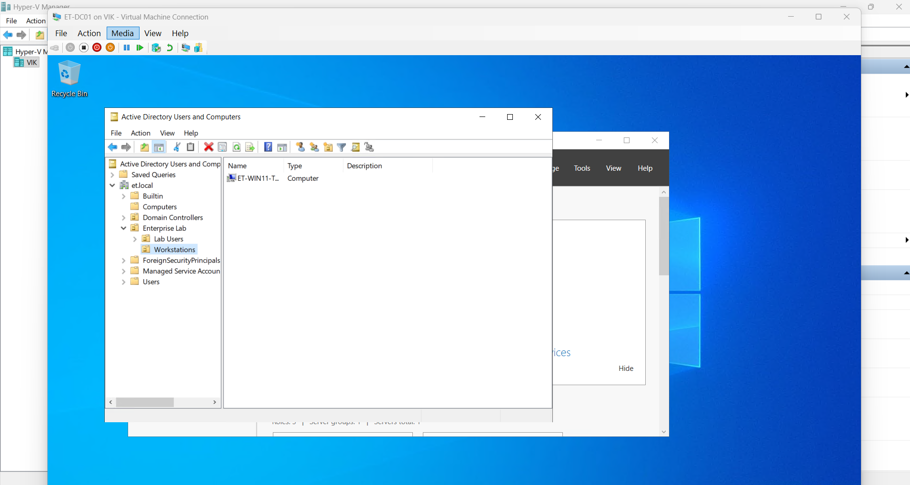
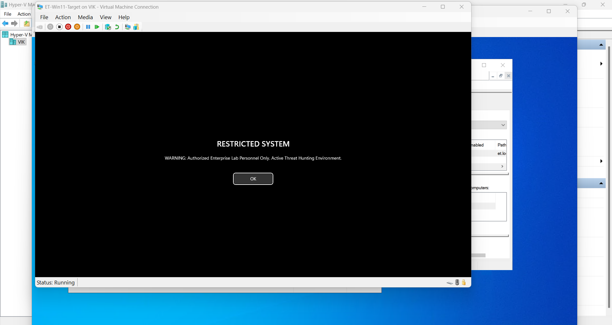

# Enterprise-Security

Deployment documentation and standard operating procedures (SOPs) for the enterprise security infrastructure, featuring isolated endpoint provisioning, Active Directory integration, SIEM telemetry generation, and active threat hunting for Everett Technologies.

## 🛠️ Infrastructure Topology & Deployment Roadmap

## ✅ Phase 1: Windows 11 Sandbox Provisioning
- **Status:** ✅ Completed
- **Documentation:** View Phase 1 SOP
- **Description:** Provisioning an isolated Hyper-V Virtual Machine (Generation 2) tailored for Windows 11, enforcing vTPM and Secure Boot compliance, and establishing a secure baseline environment on a Private Virtual Switch.

### 📸 Phase 1 Quality Assurance (QA) Validation

*1. Hyper-V Private Virtual Switch Configuration*

*2. Windows 11 Baseline Provisioning*

## ✅ Phase 2: Active Directory Integration
- **Status:** ✅ Completed
- **Documentation:** View Phase 2 SOP
- **Description:** Connecting the Windows Server Domain Controller (`ET-DC01`), configuring static IP addressing, joining the endpoint to the Active Directory domain, and deploying baseline Group Policy Objects (GPOs).

### 📸 Phase 2 Quality Assurance (QA) Validation

*1. Domain Controller Server Rename*

*2. Static IP Address Configuration*

*3. Windows 11 Domain Integration*

*4. Active Directory Users and Computers (ADUC)*

*5. GPO Baseline Policy Enforcement*

## 🔴 Phase 3: Telemetry & Log Forwarding
- **Status:** 🔴 Pending
- **Documentation:** View Phase 3 SOP
- **Description:** Deploying Sysmon (enterprise configuration) and the Splunk Universal Forwarder to the target endpoint to ensure continuous telemetry ingestion and Windows Event Log forwarding.

### 📸 Phase 3 Quality Assurance (QA) Validation

*1. Sysmon Service Verification*
*[Insert Screenshot: Sysmon service running in Windows Services]*

*2. Splunk Log Ingestion Validation*
*[Insert Screenshot: Splunk search head verifying ingestion of logs from ET-Win11-Target]*

## 🔴 Phase 4: Threat Simulation & Detection
- **Status:** 🔴 Pending
- **Documentation:** View Phase 4 SOP
- **Description:** Simulating adversarial brute-force attacks and executing PowerShell payloads to validate endpoint telemetry and hunt for malicious indicators using Splunk Processing Language (SPL).

### 📸 Phase 4 Quality Assurance (QA) Validation

*1. Simulated Attack Payload Execution*
*[Insert Screenshot: Execution of the simulated attack payload in PowerShell]*

*2. Threat Detection & SPL Validation*
*[Insert Screenshot: Splunk dashboard highlighting the detected malicious activity]*

## ⚠️ Technical Challenges & Resolutions

* **Hypervisor Compatibility & VBS Conflicts:** During initial provisioning on a Windows 11 Home host via VirtualBox, severe EFI boot sequence failures occurred. **Resolution:** Identified that native Virtualization-Based Security (VBS) and Core Isolation features locked the hardware. Upgraded the host environment to Windows 11 Pro and migrated the entire architecture to Microsoft Hyper-V. This resolved nested virtualization conflicts, natively supported Windows 11 requirements (vTPM/Secure Boot), and provided a stable, enterprise-grade Private Virtual Switch.

## 📁 Repository Directory Structure
- **/SOPs** — Step-by-step deployment documentation, threat hunting guides, and configuration files.
- **/Screenshots** — Visual QA validation of successful domain joins, telemetry mapping, and threat detection.
